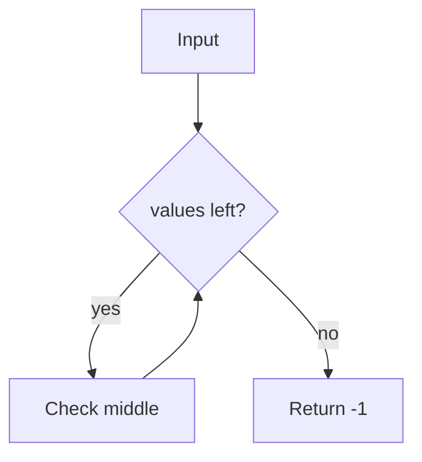

# Implementation

The demo system is implemented as a single function. The code block below
must render with syntax highlighting in both preview and PDF.

```python
def binary_search(values, target):
    low, high = 0, len(values) - 1
    while low <= high:
        mid = (low + high) // 2
        if values[mid] == target:
            return mid
        if values[mid] < target:
            low = mid + 1
        else:
            high = mid - 1
    return -1
```

The control flow is illustrated in the following diagram.



| Case          | Input        | Expected |
| ------------- | ------------ | -------- |
| Found         | `[1,2,3]`, 2 | `1`      |
| Not found     | `[1,2,3]`, 9 | `-1`     |
| Empty         | `[]`, 1      | `-1`     |
