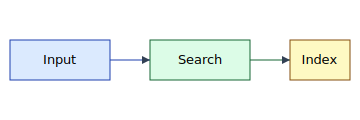

# Introduction

This section introduces the demo system. It contains exactly the kinds of
content a real SEA report body section contains: prose, a list, and an inline
reference to a figure.

The goals of the demo system are:

- demonstrate a structured Markdown section
- include a figure with a caption
- include a `[TODO]` written as inline code, which must NOT be counted

[TODO: write a better motivation paragraph]

<!-- Authoring note: this comment must not count toward length. -->
