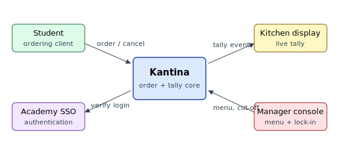

# Introduction

Every weekday between 11:45 and 12:15, roughly six hundred students and staff
pass through the canteen at Example Academy. The canteen prepares three dishes
a day in batches, and the kitchen's only signal about demand is the length of
the queue: by the time it is visible that the vegetarian dish is selling out,
the next batch is already twenty minutes away. Students standing in line
estimate their wait the same way the kitchen estimates demand — by looking at
the queue and guessing.

The canteen manager described the consequences in our first interview: food
waste on quiet days, sold-out dishes on busy ones, and a queue that regularly
spills into the atrium and makes students skip lunch altogether. The kitchen
does not need a point-of-sale replacement — payment terminals work fine — it
needs to know *before noon* what people intend to eat.

## Problem statement

The project answers the following problem statement:

> How can a pre-order system help the canteen at Example Academy match batch
> cooking to actual demand, and shorten the lunchtime queue, without slowing
> down walk-in customers who do not use it?

The problem statement breaks down into three research questions:

1. What information does the kitchen need, and how early, for pre-orders to
   change what gets cooked?
2. How should pick-up be organised so that pre-order customers are faster to
   serve than walk-ins, not slower?
3. How does the system stay correct when a batch sells out while several
   customers are ordering it at the same moment?

## Vision

**Kantina** is a desktop application for the kitchen and a thin ordering
client for students. Students place an order for one of the day's dishes
before a cut-off time; the kitchen sees a live tally per dish and locks
batch sizes at the cut-off. At lunch, pre-orders are picked up at a separate
counter against an order number, bypassing the main queue.

The system context is shown below: Kantina sits between the ordering
students, the kitchen display, and the academy's existing single sign-on.

## Scope and delimitation

The project covers ordering, the kitchen tally, batch lock-in, and pick-up
confirmation. Payment is deliberately out of scope: orders are settled at
pick-up with the existing terminals, which avoids handling money in an exam
project and keeps the walk-in flow untouched. Menu planning (deciding *which*
dishes to cook) is also out of scope; Kantina takes the day's menu as input.

## Success criteria

The group agreed three measurable criteria with the canteen manager:

| Criterion | Target | Measured by |
| --- | --- | --- |
| Demand visibility | Tally available 90 min before lunch | Cut-off timestamp |
| Pick-up speed | Pre-order pick-up under 30 seconds | Stopwatch sampling |
| Correctness | No overselling of a locked batch | Order audit log |

The criteria are evaluated in the discussion chapter.
