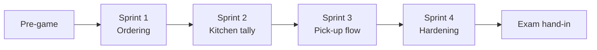
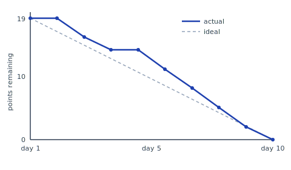

# Process and method

The group worked Scrum-inspired, as taught in the course and described in the
Scrum Guide [@scrumguide2020], adapted to a three-person student team without
a separate product owner: the canteen manager acted as customer, and one group
member relayed her priorities into the backlog between sprints.

## Sprint rhythm

The project ran as a pre-game phase followed by four two-week sprints. The
pre-game produced the problem statement, the interview notes, and a walking
skeleton: an empty three-layer application that compiled, connected to the
database, and showed a window — nothing more. Every later sprint therefore
started from something runnable.

Each sprint ended with a demonstration for the canteen manager in the actual
canteen, on a laptop next to the till. Demonstrating in the real environment
turned out to matter: the pick-up counter design changed completely after the
manager pointed out, during the Sprint 2 demo, that staff would be handling
trays with both hands and could not type order numbers.

## Roles and ceremonies

Stand-ups were held three times a week before lectures, timeboxed to ten
minutes. Sprint planning estimated stories in points using planning poker;
retrospectives produced one concrete process change per sprint, recorded in
the sprint log. The most consequential retrospective decision was made after
Sprint 1: all database access moved behind repository interfaces, because two
members had spent a day debugging SQL that the third had already rewritten.

## Velocity

| Sprint | Committed (pts) | Completed (pts) | Carry-over |
| --- | --- | --- | --- |
| 1 | 21 | 13 | 8 |
| 2 | 18 | 17 | 1 |
| 3 | 19 | 19 | 0 |
| 4 | 16 | 16 | 0 |

Sprint 1 overcommitted, which the group attributes to estimating UI work
before having written any JavaFX. The burndown for Sprint 3, the steadiest
sprint, is shown below.

## Version control and definition of done

The group used Git with short-lived feature branches and pull-request review:
no branch merged without a second member having read the diff. The definition
of done required passing unit tests, an updated repository interface where
data access changed, and the demo script updated so the feature could be
shown. Code style followed the course's checkstyle profile; names and
structure follow the guidance in Clean Code [@martin2008].
