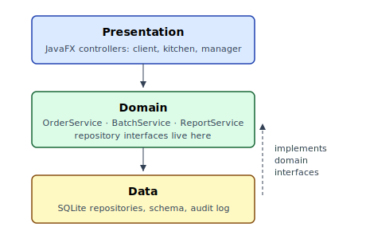
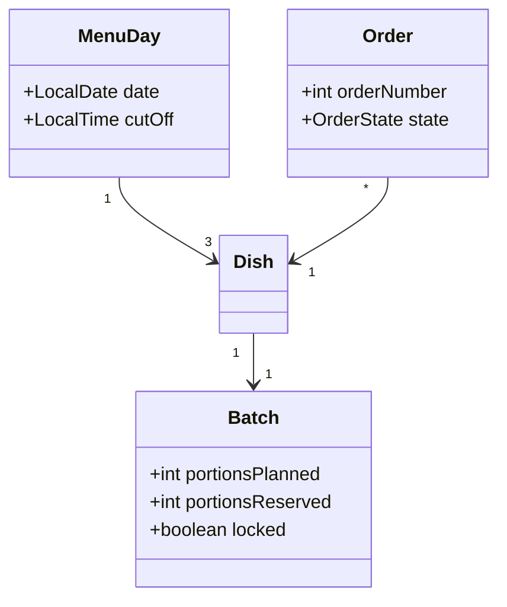
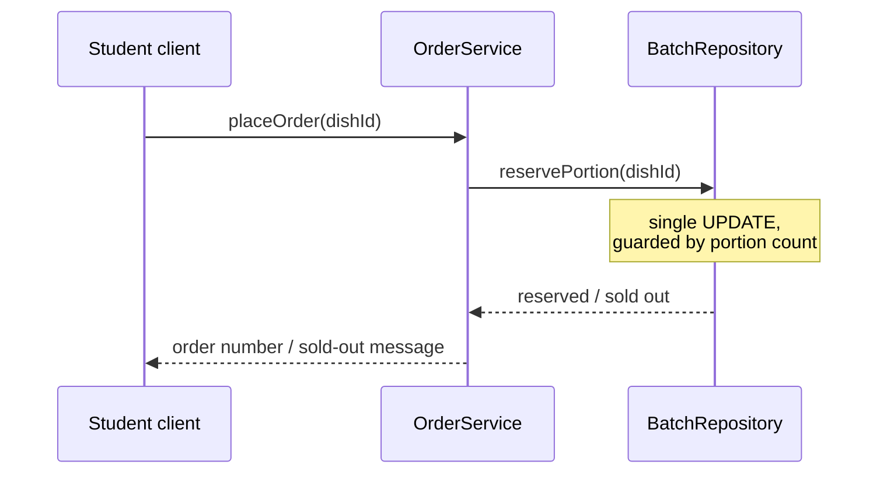

# Architecture and design

Kantina is a classic three-layer desktop application backed by a relational
database. The choice is deliberately conservative: the course's architectural
toolbox fits the problem, and the integrity requirement from the requirements
chapter is exactly what transactions in a relational database are for.

## Layered architecture

The presentation layer contains the JavaFX controllers for the three windows
(ordering client, kitchen tally, manager console) and never touches the
database directly. The domain layer owns the business rules — cut-off
enforcement, batch locking, portion accounting — and exposes them through
three services. The data layer implements repository interfaces over SQLite.

The dependency rule is enforced socially and structurally: layers depend
only downward, and the domain layer's repository interfaces are defined in
the domain package, so the data layer depends on the domain rather than the
other way around. This is the only place the architecture deviates from the
naive layering taught early in the course, and it is what made the repository
swap in the testing chapter cheap.

## Domain model

The domain model is small enough to hold in one diagram:

`Order.state` is a small state machine: `PLACED → READY → PICKED_UP`, with
`CANCELLED` reachable from `PLACED` until cut-off. The states map one-to-one
to the kitchen workflow, and every transition is written to an audit log
table — the waste report and the integrity check in the test protocol are
both queries over that log.

## The ordering flow

The sequence below shows the happy path of *Place order*, and where it locks:

The crucial design decision is visible in the note: reserving a portion is a
single guarded `UPDATE`, not a read-then-write. The concurrency chapter
shows what went wrong with the first version and why this shape is the fix.

## Design patterns

Three patterns from the course curriculum [@gof1994] carry their weight in
the codebase. *Repository* isolates SQL behind domain-named interfaces.
*Observer* drives the kitchen tally: `OrderService` publishes order events,
and the tally view subscribes, which keeps the domain layer free of any
JavaFX import. *State* implements the order lifecycle; transitions live in
one class per state instead of a switch statement spread over services.

The group consciously rejected two patterns. A *Singleton* database
connection was replaced by a connection per transaction after it serialised
the whole application during Sprint 2 load testing, and *Abstract Factory*
over the repositories was dropped as speculative generality — there is one
database, and Fowler's advice on removing flexibility nobody asked for
applied directly [@fowler2018].
