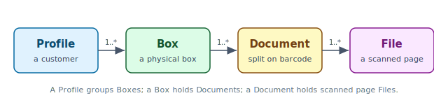

# Introduction

## Background

Tiffany is a desktop scanning tool commissioned by **WebLager A/S**, a Danish
digitisation company that converts client paper archives into a secure,
searchable digital format. The scanning step currently runs on a licensed
third-party tool the team refers to as *diamond vision*: a recurring licence
cost, a slow operator workflow, and, in the client's own words, "a bunch of
bloated and unused features". WebLager wants an in-house Java replacement that
fits their workflow exactly and removes the vendor lock-in.

The same brief is the second-semester exam project at the academy, delivered
across four sprints by a solo developer on the course stack: Java, JavaFX,
MSSQL, and a classic three-layer architecture.

## The domain

What Tiffany manages forms a top-down chain: a profile groups boxes, a box
holds documents, and a document holds the scanned page files, as shown in
@fig:hierarchy.

{#fig:hierarchy width=92%}

## Problem definition

The legacy tool is both expensive and opaque: there is no audit trail of who
scanned what and when, no separation between operator and administrator roles,
and exports land under non-deterministic filenames the downstream pipeline
cannot use as a join key. Tiffany therefore answers one question: *how do we
build a keyboard-driven scanning client that splits pages into documents on
barcode detection, names every export deterministically, and records every
action — and ship it in four sprints?*

Two criteria follow from that framing and run through the rest of the report.
Every **functional** choice is judged against the operator's seconds-per-box,
not feature breadth; and every **architectural** choice is judged against
replaceability — the mock data layer must give way to a real database without
the layers above it noticing. Keeping that line clean is exactly the
discipline *Clean Code* argues separates code that survives from code that
rots [@martin2008].
