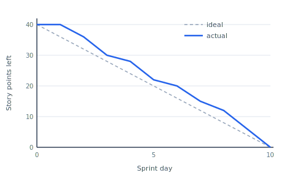

# Process and method

The project ran as four one-week sprints with a lightweight Scrum adaptation.
As @scrumguide2020 notes, Scrum is a framework to be filled in, not a fixed
recipe — for a solo developer that meant keeping the planning, review, and
retrospective as short written rituals and dropping the daily stand-up.

## Sprint plan

Each sprint closed on a demonstrable slice: something the WebLager contact
could actually try, not just code that compiled.

| Sprint | Focus                          | Demonstrable outcome                    |
| ------ | ------------------------------ | --------------------------------------- |
| 1      | Walking skeleton, mock data    | Scan a box, see documents on screen     |
| 2      | Barcode split, metadata entry  | Split on barcode, tag a document        |
| 3      | Deterministic export, audit    | Export named folders, view the audit log |
| 4      | MSSQL data layer, hardening    | Same app, real database behind it       |

## Tracking

Remaining work was tracked as a burndown per sprint. @fig:burndown shows
sprint 3, where a mid-sprint discovery — the export naming had to survive a
re-scan — bent the curve before it recovered.

{#fig:burndown width=78%}

The flat first day is deliberate: sprint planning and a spike on the audit
schema produced no closed points, which is honest tracking rather than a
stalled sprint. The lesson carried into sprint 4's estimate.
