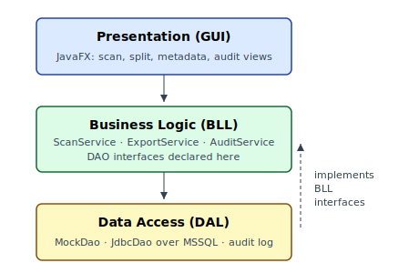
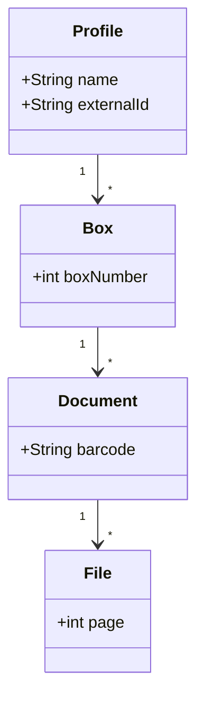
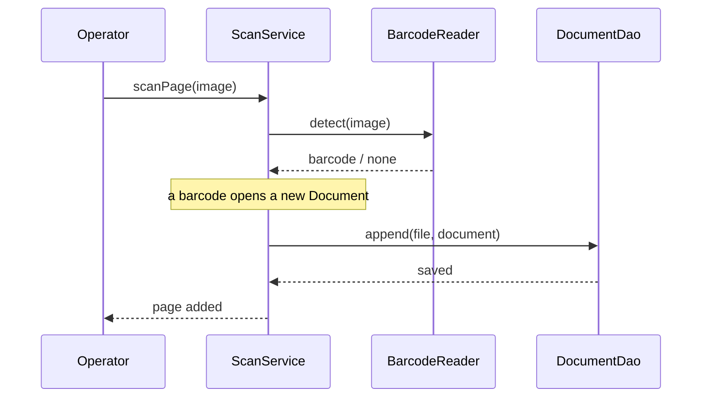

# Architecture and design

Tiffany is a classic three-layer desktop application over a relational
database. The choice is deliberately conservative: the course's toolbox fits
the problem, and the auditability requirement is exactly what a transactional
database is for.

## Layered architecture

@fig:architecture shows the three layers. The presentation layer holds the
JavaFX views and never touches the database. The business-logic layer owns the
rules — barcode splitting, deterministic naming, audit writes — behind three
services. The data layer implements the DAO interfaces.

{#fig:architecture width=70% align=center}

The one deviation from naive layering is the dependency-inversion edge: the DAO
interfaces are declared in the business layer, so the data layer depends on the
business layer rather than the reverse. That single decision is what made the
sprint-4 swap from a mock store to MSSQL cheap.

## Domain model

The domain is small enough to hold in one diagram:

## The scan-and-split flow

The sequence below is the happy path of scanning a page and where a barcode
starts a new document:

## Design patterns

Three patterns from the curriculum [@gof1994] earn their place. *Repository*
isolates SQL behind domain-named DAO interfaces. *Observer* drives the live
audit view: services publish events and the view subscribes, keeping JavaFX out
of the business layer. *State* models the document lifecycle (`OPEN → CLOSED →
EXPORTED`) as one class per state instead of a switch spread across services.

One pattern was consciously dropped. An *Abstract Factory* over the DAOs was
removed as speculative generality — there is one database, and Fowler's advice
to delete flexibility nobody asked for applied directly [@fowler2018].
